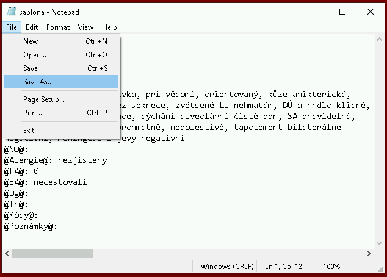

# Šablona pro zápis záznamů

V Brně, 16.3.2020

Milé kolegyně, milí kolegové,
od pátku je jasné, že záznamy o vyšetření píše každý z nás do Wordu jinak – jinak strukturuje informace, jinak pojmenovává dokumenty a jinam je ukládá. Až bude centrální systém zase fungovat, vznikne chaos při převádění těchto dat zpět do AMISu.

## Jak se tomu vyhnout?
Pišme záznamy tak, aby byly strojově čitelné. Znamená to malinkou změnu teď, ale ušetříme tím neuvěřitelné množství práce v příštích týdnech.

## Jak na to?
Zkopírujte si na Plochu dokument [sablona.txt](./docs/sablona.txt).
1. Když přijde pacient, šablonu si otevřete
2. Než začnete cokoli psát, klikněte na Soubor pak **Uložit jako** (Save As...)

{:class="img-responsive"}

3. Dokument pojmenujte ve formátu "mm_dd_prijmeni_jmeno_rodnecislo.txt", tedy např. [03_17_novak_jan_9208124218.txt](./docs/03_17_novak_jan_9208124218.txt)
4. Zapište, co je potřeba. **Nemažte a neměňte předepsaná pole mezi zavináči!**
5. Dokument průběžně ukládejte pomocí kláves **Ctrl+S**
6. Dokumenty ukládejte do jedné jediné složky
7. Pro nového pacienta opět začněte otevřením souboru [sablona.txt](./docs/sablona.txt), pak **Uložit jako**

### Přepsali jste si soubor sablona.txt omylem daty pacienta?
Udělejte kopii, smažte údaje pacienta a máte šablonu zpět. Dokud nesmažete pole mezi zavináči, nic se nestalo.

### Smazali nebo změnili jste omylem pole mezi zavináči a nemáte soubor sablona.txt?
Otevřete některý z předchozích souborů a pole zkopírujte nebo vepište. Např.: @Alergie@:

### Soubory ke stažení

 * Příklad vyplněného záznamu: [03_17_novak_jan_9208124218.txt](./docs/03_17_novak_jan_9208124218.txt)
 * Tento návod, např. pro nahrání na flash: [navod.docx](./docs/navod.docx), [navod.pdf](./docs/navod.pdf)
 * Šablona záznamu: [sablona.txt](./docs/sablona.txt)
 * Vše výše jako archiv .zip: [SablonaAMIS.zip](./docs/SablonaAMIS.zip)
 * Podepsaný archiv [SablonaAMIS.zip.gpg](./docs/SablonaAMIS.zip.gpg), [GPG](https://pgp.mit.edu/pks/lookup?search=michal.babacek%40gmail.com&op=index)
